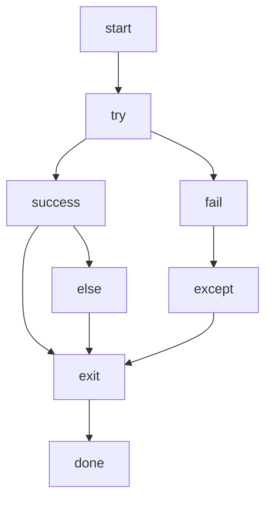

# Errors and Error Handling

We spoke about error in the first modules but very briefly and highlighting primarily suntax errors.

However, there are several different errors that you will encounter and in this chapter, we will go over an overview of it these and talk about handling them.

Why would you want to handle errors? so you application doesn't crash unintentionally.

So far in the course, you probably would have encountered some errors in your code from time to time.

In Python, there are two main kinds of distr=inguishable errors:

* Syntax errors
* Exceptions

## Syntax errors

This is by far, the most common error you would've seen. A syntax error is just a situation where the Python interpreter is telling you that your code isn't adhering to the correct Python syntax (a.k.k "I have no idea what you mean").

```Python

This is not valid code

print("this is also invalid code')
```

The above will generate a `SyntaxError: invalid syntax`

## Exceptions

Even with the correct syntax, your program may still encounter error when an attempt is made to run it.

Errors detected during program execution are called exceptions. These can be handled gracefully. SO much so, you can even raise your own exceptions.

### try-except

The `try-except` pattern is used in python to handle errors. This is the equivalent to the `try-catch` in most other languages.

```Python
try:
    a = 5 / 0
except Exception:
    print("can't divide by 0")
```

The _try_ block gets executed first until an exception is raised or it successfully completes...whichever happens first. The _except_ block only gets executed if the try component raises an exception.

In the example above, the exception is raised because divison by zero is impossible.

```Python
try:
    a = 5 / 0
except Exception as e:
    print(e)
```

The above code where we define `Exception as e`, gives access to the data from the exception. The `as` keyword allows us to define an _alias_ of sorts for the exception, as we did with modules.

> [!NOTE]
> If no exceptions are raised in the try block, the except block won't execute.
> If an exception is raised outside of the try block, the program crashes and prints the exception.

### The else block

With the _try-except_ block, there is an extra section that can be added called _else_, _else_ executes once the _try_ was successful.

The execution goes like this:

```Python
try:
    a = 5 / 10
except Exception as e:
    print(e)
else:
    print(a)
```



### Raising your own Exceptions
Python has a special keyword, `raise`, which allows the programmer to 'raise' their own exceptions in order to assist with debugging and managing program crashes.

The _raise_ statement consists of:
* The raise keyword
* Calling the Exception() function
* A string of useful text to be passed to the function

Let's look at an example:

```Python
user_input = input("Enter a letter: ")

if user_input.is_digit():
    raise Exceptioin("not a letter")
else:
    print(user_input)
```

### Types of Exceptions

There are several different types of exceptions that can be raised in Python:

|Exception|Description|
|--|--|
|Exception|General Exception handling|
|NameError|This is raised if a variable is not "defined" or can be found|
|IndexError|Raised when referencing an index in a data set that does not exist|
|KeyError|Similar to IndexError, KeyError is raised when accessing a key that does not exist (like in Dictionaries)|
|ValueError|This is raised when trying to access or convert data in an invalid format (eg. convert the string "fifteen" to a number through the int() function|
|TypeError|Simiar to the ValueError|
|ZeroDivsionError|This is raised when you attempt to perform a calculation, where the denominator is 0 or does not exist|

Python has many others but for the purposes of this class, these are the most common you may encounter.

> [!TIP]
> For more details on all the exceptions that Python has, please the offical docs:
> [Python Docs](https://docs.python.org/3/library/exceptions.html)
